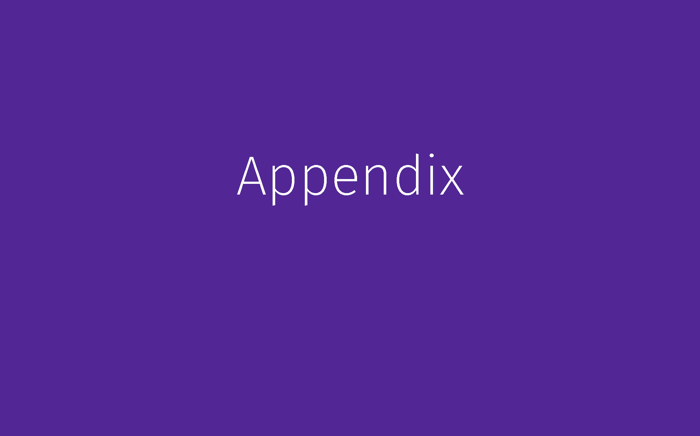

# Manc - A theme for LaTeX-Beamer

A Manchester-styled beamer theme.

This is an unofficial theme, the University of Manchester logo is copyright of the University of Manchester.

Lots of ideas have been taken from

 - [The metropolis theme](https://github.com/matze/mtheme)
 - [The tudoposter theme](https://github.com/MaxNoe/tudoposter)

## Demo

See [demo.pdf](./demo.pdf) or the rendered images below.

